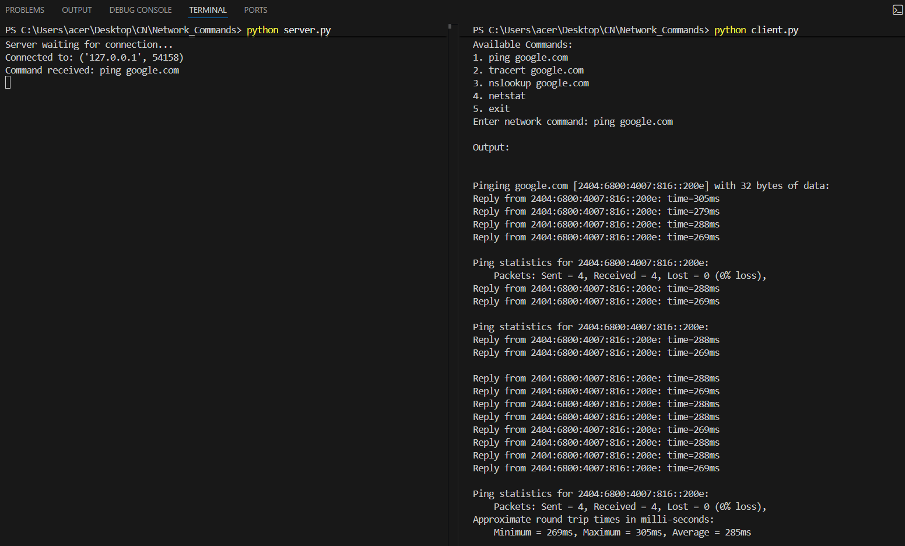
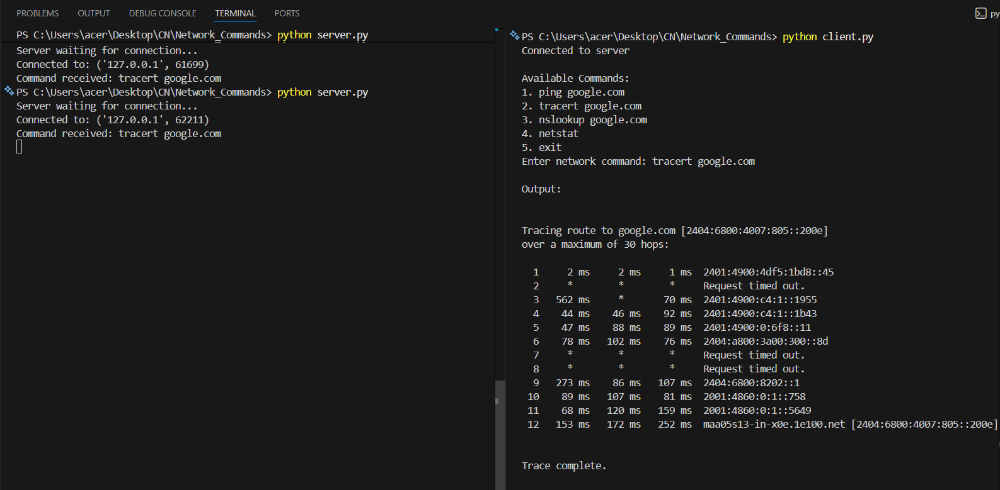
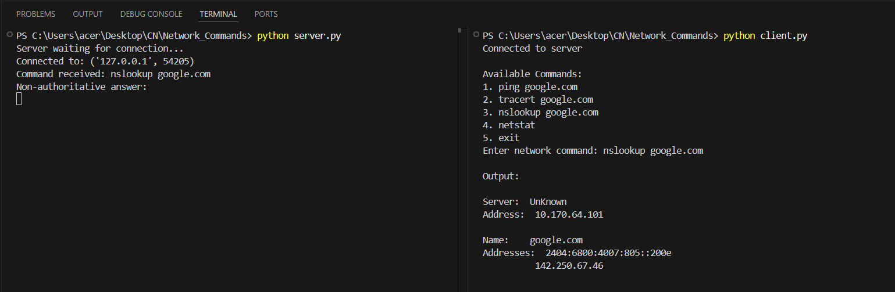
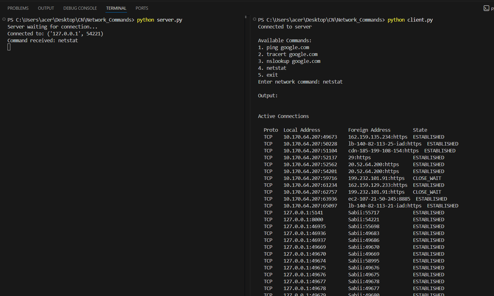

# 4.Execution_of_NetworkCommands
## AIM :Use of Network commands in Real Time environment
## Software : Command Prompt And Network Protocol Analyzer
## Procedure: To do this EXPERIMENT- follows these steps:
<BR>
In this EXPERIMENT- students have to understand basic networking commands e.g cpdump, netstat, ifconfig, nslookup ,traceroute and also Capture ping and traceroute PDUs using a network protocol analyzer 
<BR>
All commands related to Network configuration which includes how to switch to privilege mode
<BR>
and normal mode and how to configure router interface and how to save this configuration to
<BR>
flash memory or permanent memory.
<BR>
This commands includes
<BR>
• Configuring the Router commands
<BR>
• General Commands to configure network
<BR>
• Privileged Mode commands of a router 
<BR>
• Router Processes & Statistics
<BR>
• IP Commands
<BR>
• Other IP Commands e.g. show ip route etc.
<BR>
#PROGRAM :

server
```
import socket
import os

server = socket.socket(socket.AF_INET, socket.SOCK_STREAM)

host = "127.0.0.1"
port = 8000

server.bind((host, port))
server.listen(5)

print("Server waiting for connection...")

conn, addr = server.accept()
print("Connected to:", addr)

while True:
    data = conn.recv(1024).decode()

    if not data:
        break

    print("Command received:", data)

    result = os.popen(data).read()

    if result == "":
        result = "Command executed but no output"

    conn.send(result.encode())

conn.close()
server.close()
```
client:
```
import socket

client = socket.socket()
client.connect(("127.0.0.1", 8000))

print("Connected to server")
 
while True:

    print("\nAvailable Commands:")
    print("1. ping google.com")
    print("2. tracert google.com")
    print("3. nslookup google.com")
    print("4. netstat")
    print("5. exit")

    cmd = input("Enter network command: ")

    if cmd.lower() == "exit":
        break

    client.send(cmd.encode())

    result = client.recv(4096).decode()

    print("\nOutput:\n")
    print(result)

client.close()
```

## Output:
ping command:

Trace route command:

Nslookup command:

Netstat command:

## Result
Thus Execution of Network commands Performed 
